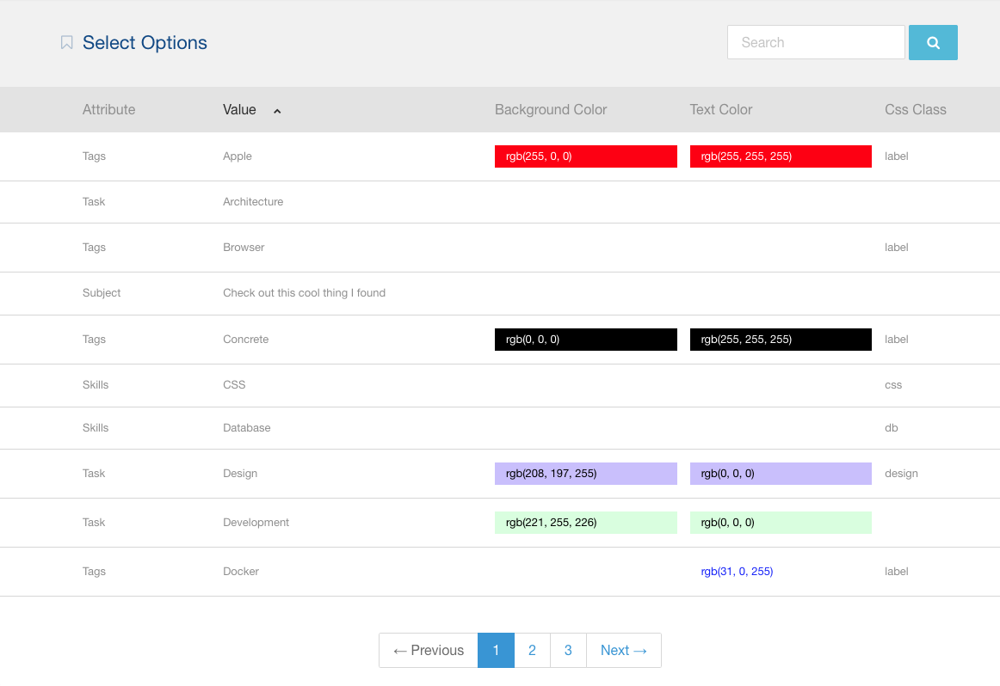
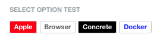

# Macareux Attribute Value Utilities

A Concrete CMS package that provides a set of utilities to work with attribute values.

## Features

### Select Attribute Value Options Options

Make it enable to set css class, background color, and text color for each option of select attribute value.



#### How to get options of select attribute value options

You can get css class or style text by using service class.

```php
$optionService = app(\Macareux\AttributeValueUtilities\Service\SelectValueOptionService::class);
// $option should be an instance of \Concrete\Core\Entity\Attribute\Value\Value\SelectValueOption class
$optionOption = $optionService->getSelectValueOptionOption($option);
$style = $class = '';
if ($optionOption) {
    $style = $optionOption->getStyle();
    $class = $optionOption->getCssClass();
}
```

There's an example template of Tags block to show how to get options of select attribute values.



## To Do

* **Topic Attribute Node Options**: Make it enable to set css class, background color, and text color for each topic node of topic trees.
* **Select Attribute Value Service Class**: Provides a easy way to get the options of a select attribute key.
* **Topic Attribute Value Service Class**: Provides a easy way to get the nodes of a topic attribute key.

## License

This package is open-sourced software licensed under the [MIT license](https://opensource.org/license/MIT).
